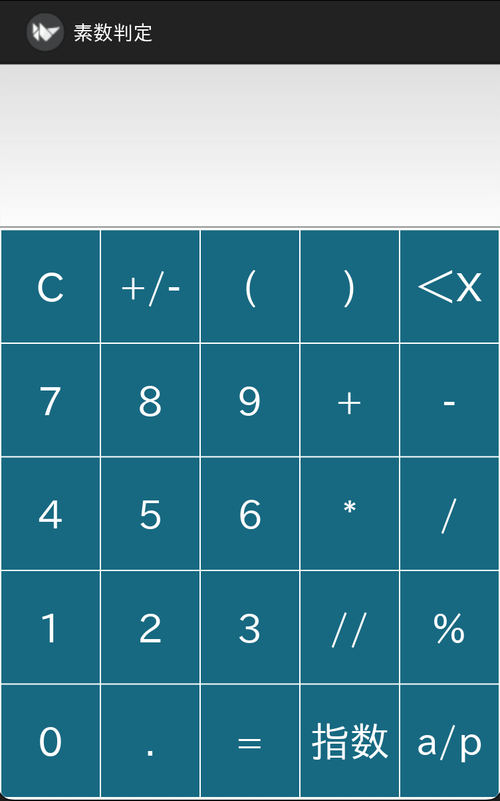
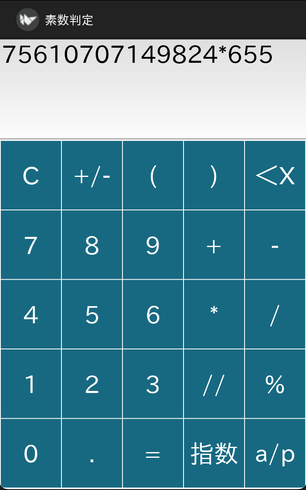
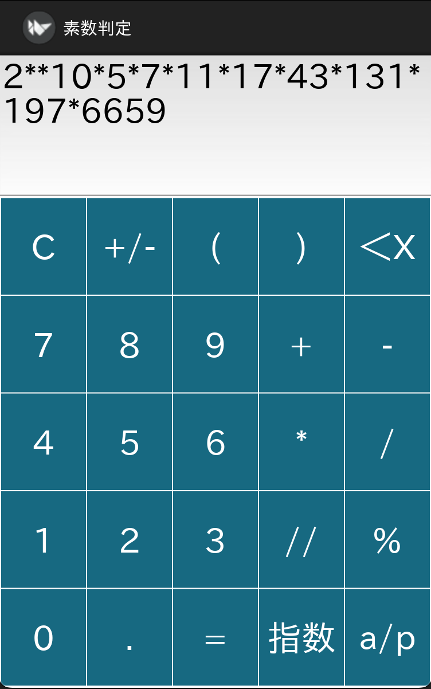

# Prime Number Calculator

Kivy + japanize_kivy によるシンプルな計算アプリです。  
Python で GUI アプリを作成し、macOS 上で動作確認し、iOS 向けにビルドできます。

## スクリーンショット

| 起動画面                   | 入力中                     | 結果表示                   |
| -------------------------- | -------------------------- | -------------------------- |
|  |  |  |

## 主な機能

- 数値入力と演算（+ - * / // %）
- 日本語対応のラベルとUI
- 指数表記への変換（例: `12345678` → `1.234568e+07`）
- 素因数分解機能（例: `60` → `2**2*3*5`）
- 簡易Mersenne素数判定付き
- タイムアウト（計算が3秒以上かかるとエラー表示）
- フルキーボードUI（`.kv`ファイルで定義）

## 環境セットアップ（macOS + uv）

### 1. `uv` インストール（初回のみ）

```bash
pip install uv
```

### 2. 仮想環境の作成と依存ライブラリのインストール

```bash
make setup
```

## アプリ実行（macOS）

```bash
make run
```

## iOSアプリのビルド手順

> macOS + Xcode が必要です（Apple IDで無料ビルド可）

### 1. iOSビルド用ツールのインストール

```bash
pip install cython
pip install kivy-ios
```

### 2. iOSプロジェクト作成〜アプリビルド

```bash
make ios
```

* `src/main.py` をもとに `primecalc/` フォルダが自動生成され、必要ライブラリをビルドします。

### 3. iOSシミュレータで起動 or 実機用に Xcode を開く

```bash
make ios-open
```

## Makefile コマンド一覧

| コマンド        | 内容                                              |
| --------------- | ------------------------------------------------- |
| `make setup`    | 仮想環境と依存ライブラリのインストール（macOS用） |
| `make run`      | macOS上でアプリを起動                             |
| `make ios`      | iOS向けにプロジェクトを生成してビルド（自動化済） |
| `make ios-open` | Xcodeで開いて署名・実機ビルドを行う               |

## 注意事項

* iOS用ライブラリは `sh/build_ios.sh` に明示的に指定されています（pipではなくtoolchainでビルドされます）
* `.kv` ファイルは App クラス名に対応する必要があります（`Calculator` → `calculator.kv`）
* `uv` は macOS開発用、iOSビルドは system Python（またはvenv外）で行います
* `primecalc/` は自動生成されるため Git 管理しません
